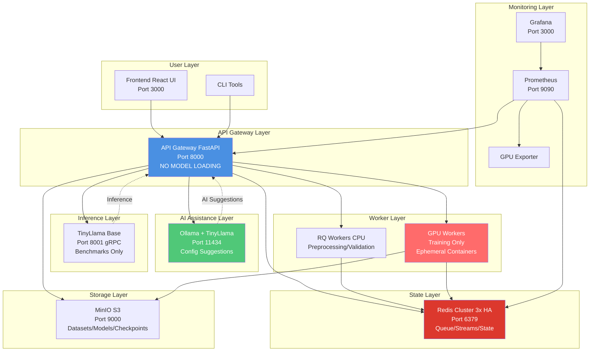
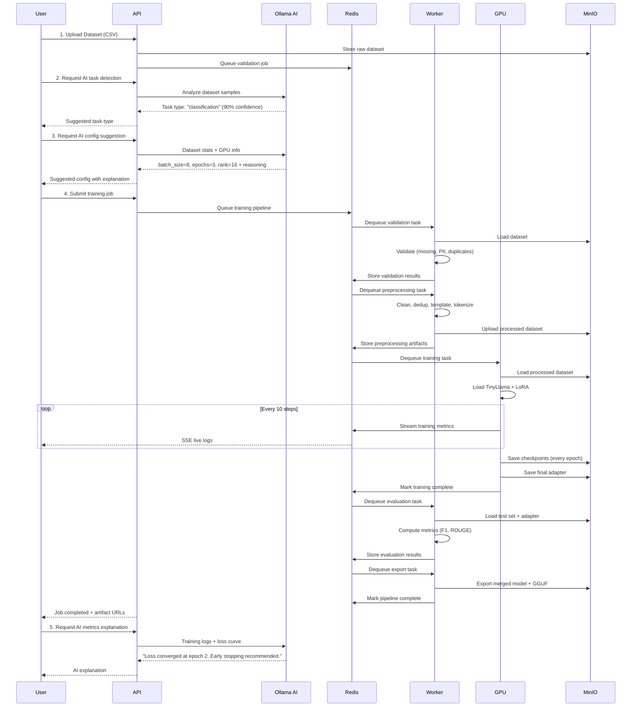
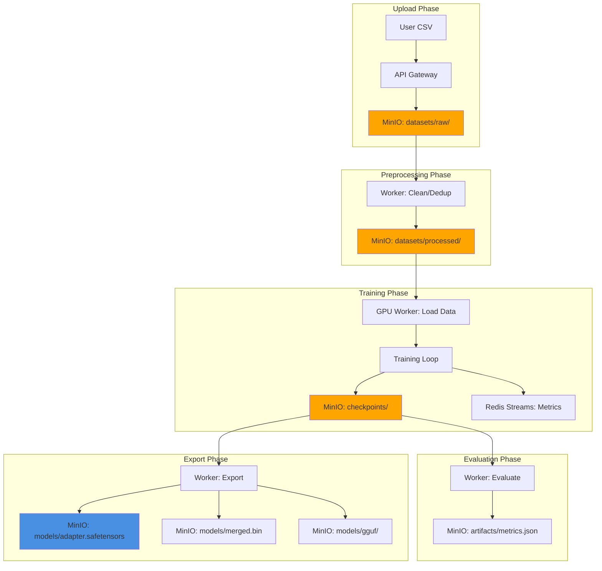
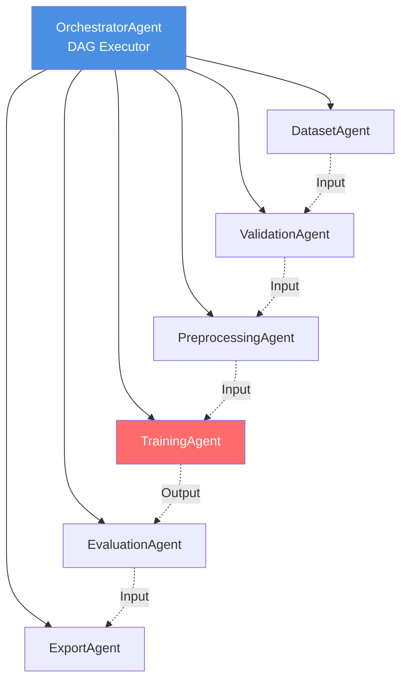
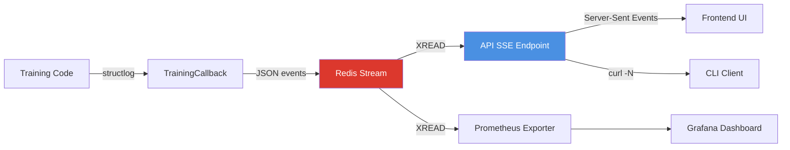
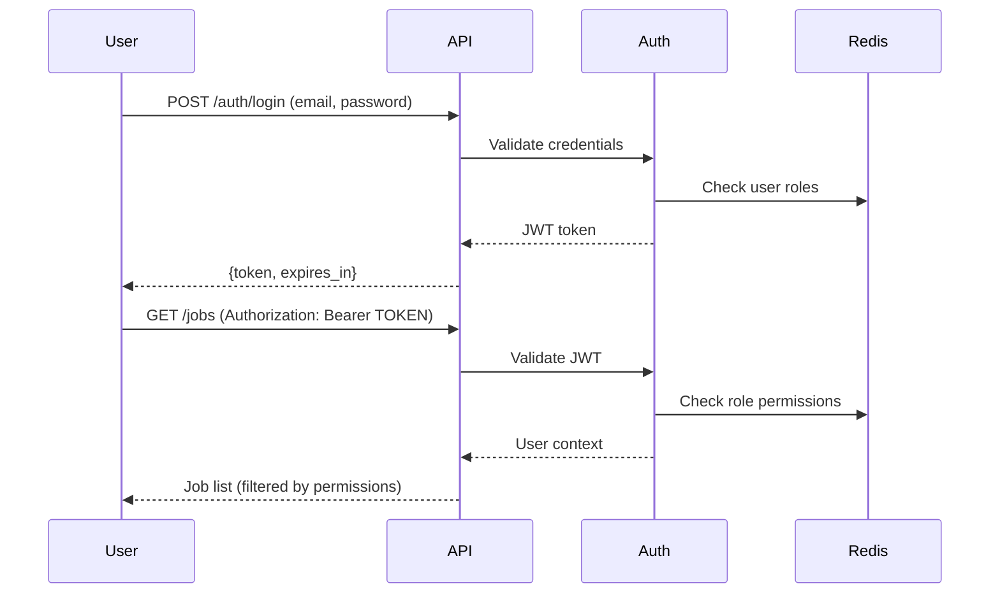
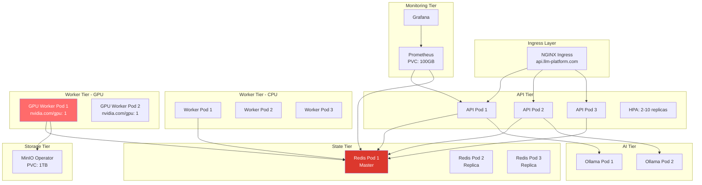

# LLM Fine-Tuning Platform - Architecture Overview

> **Industrial-Grade, Multi-Container, AI-Assisted Fine-Tuning Platform**

## 🎯 System Overview

The LLM Fine-Tuning Platform is a production-ready, enterprise-scale system for fine-tuning large language models with real-time AI assistance, monitoring, and multi-container isolation.

### Key Capabilities

- 🤖 **AI-Assisted Configuration** - TinyLlama suggests optimal hyperparameters
- 🔄 **Multi-Container Isolation** - No single point of failure
- 📊 **Real-time Monitoring** - Prometheus + Grafana dashboards
- 🚀 **Auto CPU/GPU Detection** - Seamless hardware adaptation
- 📦 **Production Ready** - Docker Compose + Kubernetes manifests

---

## 🏗️ Multi-Container Architecture



### Container Responsibilities

| Container | Purpose | Port | Scaling |
|-----------|---------|------|---------|
| **api-gateway** | Orchestration, routing, auth | 8000 | Horizontal (HPA) |
| **ollama** | AI assistant (TinyLlama) | 11434 | Vertical |
| **tinyllama-base** | Inference benchmarks | 8001 | 2x HA |
| **worker-cpu** | Preprocessing, validation | - | 5x workers |
| **worker-gpu** | Training only (ephemeral) | - | 1 per GPU |
| **redis-cluster** | Queue, streams, state | 6379 | 3x replicas |
| **minio** | Object storage | 9000 | Operator managed |
| **prometheus** | Metrics collection | 9090 | Single |
| **grafana** | Dashboards | 3000 | Single |

---

## 🔄 Complete Pipeline Flow



---

## 🧠 AI Assistant Integration

### TinyLlama via Ollama (Container #5)

**Purpose**: Intelligent, context-aware assistance throughout the fine-tuning workflow.

```mermaid
graph LR
    subgraph "AI Capabilities"
        A[Task Detection<br/>CSV → Task Type]
        B[Config Suggestion<br/>Dataset → Hyperparams]
        C[Metrics Explanation<br/>Logs → Insights]
        D[Error Diagnosis<br/>Warnings → Fixes]
    end
    
    subgraph "Integration Points"
        E[/ai/detect-task]
        F[/ai/suggest-config]
        G[/ai/explain-metrics]
        H[/ai/diagnose-errors]
    end
    
    subgraph "Ollama Service"
        I[TinyLlama 1.1B<br/>Pre-pulled in Dockerfile]
    end
    
    A --> E
    B --> F
    C --> G
    D --> H
    
    E --> I
    F --> I
    G --> I
    H --> I
    
    style I fill:#50C878,color:#fff
```

### AI-Powered Features

#### 1. Task Detection
**Input**: 10 sample rows from dataset  
**Output**: `{task_type: "classification", confidence: 0.92, target_column: "label"}`

**Logic**:
```python
prompt = f"""
Analyze these dataset samples and determine the ML task:
{samples}

Respond with ONLY JSON: {{"task_type": "...", "confidence": 0-1}}
Task types: classification, chat, summarization, qa, extraction
"""
```

#### 2. Hyperparameter Suggestion
**Input**: Dataset stats, GPU availability, task type  
**Output**: Recommended config + reasoning

**Logic**:
- Small dataset (<1k rows) → rank=8, epochs=5
- Large dataset (>100k rows) → rank=32, epochs=2
- GPU available → fp16, larger batch size
- CPU only → fp32, smaller batch size

#### 3. Metrics Explanation
**Input**: Training logs, loss curve  
**Output**: Human-readable insights

**Example**:
> "Your loss decreased rapidly in epoch 1 (2.3 → 1.1) but plateaued in epoch 2. This suggests the model has converged. Early stopping at epoch 2 would save compute without sacrificing accuracy."

---

## 🗄️ Data Flow & Storage



### MinIO Bucket Structure

```
minio/
├── datasets/
│   ├── raw/              # Original uploads
│   │   └── ds_abc123.csv
│   └── processed/        # Tokenized, templated
│       └── ds_abc123_processed.json
├── models/
│   ├── base/             # Cached base models
│   │   └── TinyLlama-1.1B/
│   ├── adapters/         # LoRA weights
│   │   └── job_xyz789_adapter.safetensors
│   ├── merged/           # Full merged models
│   │   └── job_xyz789_merged.bin
│   └── gguf/             # Quantized exports
│       └── job_xyz789_Q4_K_M.gguf
├── checkpoints/          # Training checkpoints
│   └── job_xyz789/
│       ├── epoch_1/
│       └── epoch_2/
└── artifacts/            # Logs, metrics, cards
    └── job_xyz789/
        ├── metrics.json
        ├── training_curve.png
        └── model_card.json
```

---

## 🔑 Agent-Based Execution

### Agent Hierarchy



### Agent Communication Protocol

All agents follow a **stateless, JSON-based I/O contract**:

```python
class BaseAgent(ABC):
    @abstractmethod
    def execute(self, input_data: dict) -> dict:
        """
        Execute agent logic.
        
        Args:
            input_data: {
                "run_id": str,
                "config": dict,
                "previous_output": dict  # From upstream agent
            }
        
        Returns: {
            "status": "success" | "error",
            "output": dict,  # Passed to downstream agent
            "artifacts": dict,  # S3 URLs
            "metrics": dict   # For monitoring
        }
        """
```

### DAG Execution Flow

**OrchestratorAgent** uses topological sort to execute agents in dependency order:

```python
# Example pipeline DAG
nodes = ["dataset", "validation", "preprocessing", "training", "evaluation"]
edges = [
    ("dataset", "validation"),
    ("validation", "preprocessing"),
    ("preprocessing", "training"),
    ("training", "evaluation")
]

# Execution order: [dataset, validation, preprocessing, training, evaluation]
```

**Fault Tolerance**:
- Each agent retries 3x with exponential backoff
- State persisted in Redis after each agent
- Failed agents → dead letter queue
- Pipeline resumable from last successful agent

---

## 📊 Real-Time Observability

### Log Streaming Architecture



### Log Event Types

```json
// System Log
{
  "run_id": "job_123",
  "timestamp": "2025-12-28T23:08:00Z",
  "level": "INFO",
  "agent": "TrainingAgent",
  "message": "Loading model TinyLlama-1.1B"
}

// Metric Event
{
  "run_id": "job_123",
  "timestamp": "2025-12-28T23:10:15Z",
  "level": "METRIC",
  "agent": "TrainingAgent",
  "step": 100,
  "epoch": 1,
  "loss": 1.42,
  "learning_rate": 0.0002,
  "samples_per_sec": 12.5
}

// Error Event
{
  "run_id": "job_123",
  "timestamp": "2025-12-28T23:12:00Z",
  "level": "ERROR",
  "agent": "ValidationAgent",
  "error_code": "MISSING_VALUES",
  "message": "12% missing values in column 'target'"
}
```

### Prometheus Metrics

```python
# API Metrics
api_requests_total{endpoint="/jobs", method="POST", status="200"}
api_latency_seconds{endpoint="/jobs", quantile="0.95"}

# Training Metrics
training_loss{job_id="job_123", epoch="1"}
training_throughput_samples_per_sec{job_id="job_123"}

# GPU Metrics
gpu_utilization_percent{gpu_id="0"}
gpu_memory_used_bytes{gpu_id="0"}
gpu_temperature_celsius{gpu_id="0"}

# Queue Metrics
rq_queue_depth{queue="training"}
rq_job_duration_seconds{queue="training", quantile="0.95"}

# System Metrics
redis_connected_clients
minio_bucket_objects_total{bucket="models"}
```

---

## 🔒 Security & Production Features

### Authentication Flow



### Rate Limiting

```python
# Configured via slowapi
limits = {
    "/ai/*": "10/minute",           # AI endpoints
    "/jobs POST": "5/minute",        # Job submission
    "global": "100/minute"          # All requests
}
```

### PII Redaction

**Auto-detected patterns**:
- Email addresses
- Phone numbers
- Social Security Numbers
- Credit card numbers
- Named entities (using NER)

**Action**: Logged as warnings, optionally redacted from training data.

---

## ☸️ Kubernetes Deployment

### Cluster Architecture



### Resource Allocation

```yaml
# API Gateway
requests:
  cpu: 500m
  memory: 1Gi
limits:
  cpu: 2000m
  memory: 4Gi

# GPU Worker
requests:
  cpu: 2000m
  memory: 8Gi
  nvidia.com/gpu: 1
limits:
  cpu: 4000m
  memory: 16Gi
  nvidia.com/gpu: 1

# Ollama
requests:
  cpu: 1000m
  memory: 4Gi
limits:
  cpu: 2000m
  memory: 8Gi
```

---

## 🎯 Key Design Decisions

### 1. Why Multi-Container Isolation?

**Problem**: Loading large models in API container → OOM kills, slow startup  
**Solution**: Dedicated containers for inference (TinyLlama base) and training (GPU workers)  
**Benefit**: API restarts in <5s, training failures don't affect API

### 2. Why Ollama for AI Assistant?

**Alternatives Considered**: OpenAI API, HuggingFace Inference  
**Decision**: Ollama (self-hosted)  
**Reasons**:
- No external API costs
- Data privacy (no data leaves cluster)
- Pre-pulling models in Dockerfile (zero runtime delay)
- Auto CPU/GPU detection

### 3. Why Redis Streams for Logs?

**Alternatives Considered**: Kafka, RabbitMQ, Database polling  
**Decision**: Redis Streams  
**Reasons**:
- Persistent, ordered, multi-consumer
- Same infrastructure as queue (no extra service)
- Built-in consumer groups for replay
- Low latency (<10ms) for real-time UX

### 4. Why Agent-Based Architecture?

**Alternatives Considered**: Monolithic pipeline, DAG frameworks (Airflow)  
**Decision**: Custom agent-based system  
**Reasons**:
- Modular: Each agent independently testable
- Stateless: Horizontal scaling without coordination
- Composable: Users build custom DAGs
- LLM-native: Designed for ML workloads, not generic ETL

### 5. Why CPU/GPU Auto-Detection?

**Problem**: Users have diverse hardware (cloud VMs, local GPUs, M1 Macs)  
**Solution**: `gpu_manager.py` detects availability, adjusts precision/batch size  
**Benefit**: Same codebase works everywhere, no manual configuration

---

## 📈 Performance Characteristics

### Throughput

| Operation | Throughput | Notes |
|-----------|-----------|-------|
| Dataset upload | 50 MB/s | MinIO direct upload |
| Preprocessing | 10k rows/min | CPU workers |
| Training (LoRA) | 5-15 samples/sec | Depends on GPU |
| Inference (base model) | 100 tokens/sec | vLLM optimized |
| Log streaming | <50ms latency | SSE via Redis Streams |

### Scalability Limits

- **API**: Tested up to 1000 req/min (HPA: 2-10 pods)
- **Workers**: Tested with 50 concurrent jobs (queue depth 200)
- **GPU Workers**: Tested with 8x NVIDIA A100 (K8s StatefulSet)
- **Redis**: Tested with 100k queue items, 10GB stream data

### Resource Requirements

**Minimum (CPU-only)**:
- 4 vCPUs
- 16 GB RAM
- 100 GB storage
- Docker Compose

**Recommended (GPU)**:
- 8 vCPUs
- 32 GB RAM
- 1 TB storage
- 1x NVIDIA GPU (8+ GB VRAM)
- Kubernetes cluster

**Production (Multi-GPU)**:
- 32 vCPUs
- 128 GB RAM
- 5 TB storage (MinIO distributed)
- 4x NVIDIA A100 GPUs
- Kubernetes with GPU Operator

---

## 🚀 Future Enhancements

### Phase 8: Advanced Features
- [ ] Distributed training (DeepSpeed multi-GPU)
- [ ] Experiment tracking (MLflow integration)
- [ ] Cost estimation (GPU hours, storage)
- [ ] A/B testing framework
- [ ] Model serving (vLLM deployment)

### Phase 9: Enterprise Features
- [ ] Multi-tenancy (team workspaces)
- [ ] SSO integration (SAML, OIDC)
- [ ] Audit logs (compliance)
- [ ] SLA monitoring
- [ ] Backup/restore pipelines

### Phase 10: AI Enhancements
- [ ] Auto-dataset cleaning (AI-powered)
- [ ] Hyperparameter optimization (Optuna)
- [ ] Model selection (AI recommends base model)
- [ ] Anomaly detection (training divergence alerts)

---

## 📚 Related Documentation

- [Implementation Plan](../implementation_plan.md) - Detailed build roadmap
- [API Specification](./API_SPEC.md) - Complete endpoint reference
- [Quick Start](./QUICKSTART.md) - 5-minute setup guide
- [Task Breakdown](../task.md) - Development checklist
- [Workflows](../.agent/workflows/) - Automation scripts

---

**Last Updated**: 2025-12-28  
**Version**: 2.0  
**Status**: Production-Ready Architecture
